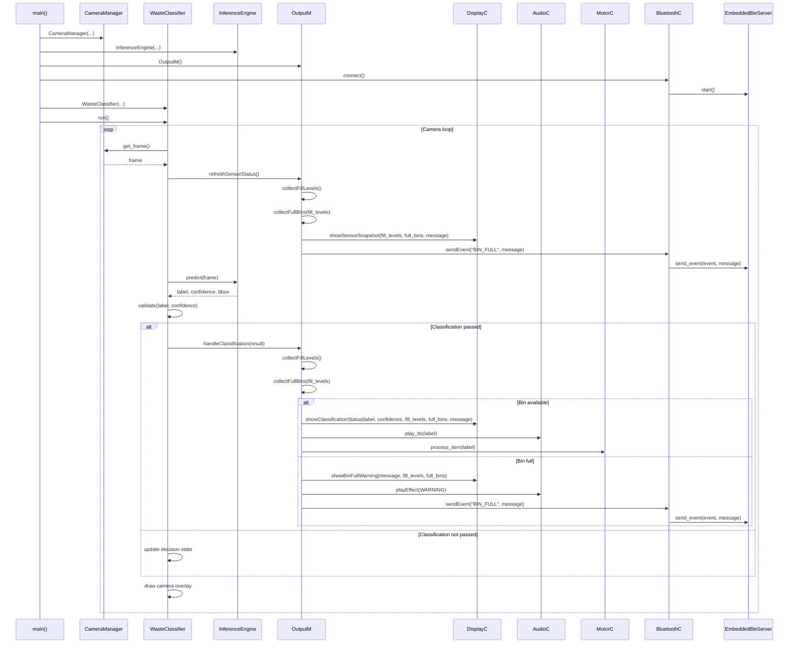
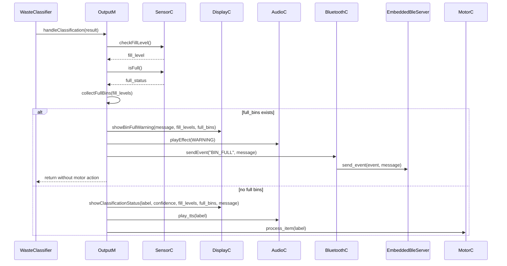
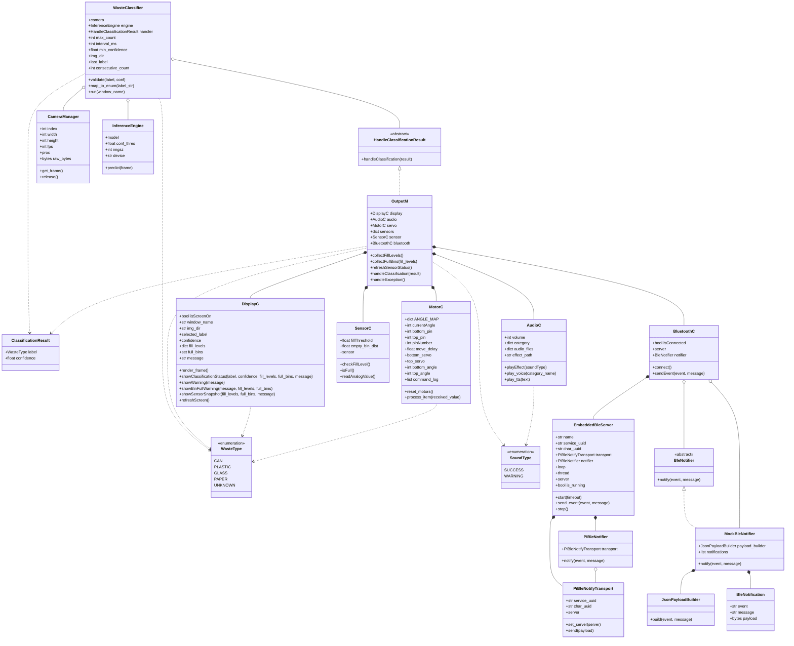

# UML Diagrams

PNG versions:

- [Class Diagram](images/class-diagram.png)
- [Code Flow Sequence Diagram](images/code-flow-sequence.png)
- [Full Bin Exception Sequence Diagram](images/full-bin-exception-sequence.png)
- [User Sequence Diagram](images/user-sequence.png)

## Code Flow Sequence Diagram

## Full Bin Exception Sequence Diagram

## Class Diagram

